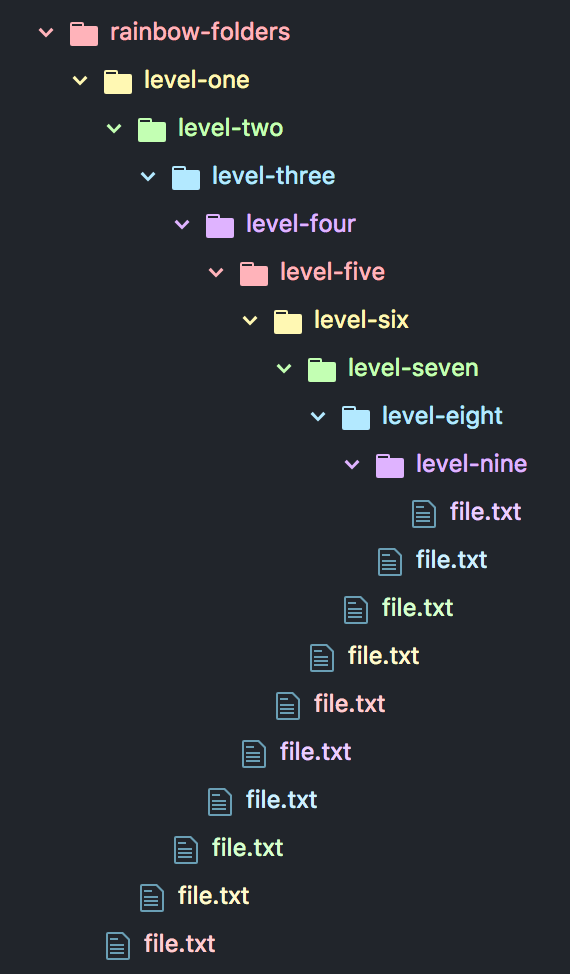

# Rainbow Tree

## 🌈🌳

Applies a text colour to file and folder names in the tree-view, so that each level uses a different rainbow colour.

This makes it easier to tell which folder a file belongs to, particularly in codebases with lots of nested files. It also looks really nice.

## Colours

Five colours are used to represent the rainbow:

- @pastel-red: #ffb3ba
- @pastel-yellow: #fff8b3
- @pastel-green: #c3ffb3
- @pastel-blue: #b3e9ff
- @pastel-violet: #dfb3ff

They rotate up to 12 levels deep. If there are any files deeper than this, then they take the 12th colour, or 12 modulus 5, so the 2nd colour in the list (yellow).

### Exceptions

- Files at root level remain the default theme colour (this is white in the One Dark theme).
- Files and folders, and all their contents, that appear in the `gitignore` file, are coloured grey.
- Files and folders that are new since the last git commit are green.
- Files and rolders that have been modified since the last git commit are amber.

Files in the root of the project also don't receive a rainbow colour, so in the default colour scheme of Atom, they appear as white. Folders at root receive the pastel-red colour.

## How to use

Install the package either from the command line or from the Install pane of the Settings menu. The colours should apply immediately. To disable, go to the Installed Packages menu in the Setting pane and disable the `rainbow-tree` package.

## Note

This package was developed for the One Dark theme of Atom. If you have a light theme it will probably look rubbish.
